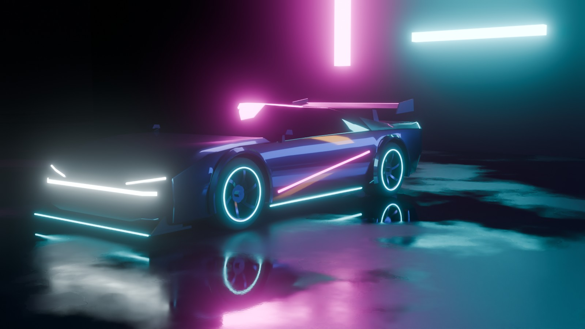

# Cyberpunk Drift

A high-end 3D arcade drifting game for the browser: a rain-soaked neon city at night,
wet asphalt reflections, volumetric fog, tyre smoke, and full controller support.


<sub>The player car, generated entirely by `blender/scripts/cyberpunk_car.py` and rendered by its preview stage.</sub>

## Game modes

- **Free Drift**: an open night city with drift zones, combos and scoring.
- **Highway Traffic Swimming**: an endless neon highway where you weave through dense
  traffic at speed for near-miss combos.

## Status

**Phase 0: foundations.** The architecture, roadmap, toolchain and Blender car pipeline
are in place, and the car renders in the browser. Driving starts in Phase 1; see
[docs/ROADMAP.md](docs/ROADMAP.md).

## Quick start

```bash
npm install
npm run dev          # smoke test: the generated car with neon bloom
npm run build        # typecheck + production build
```

Regenerate the car (Blender 4.2 LTS+ on your `PATH`):

```bash
npm run assets:car   # blender -b -P blender/scripts/cyberpunk_car.py -- --export public/models/cars/player_car.glb
```

Or open `blender/scripts/cyberpunk_car.py` in Blender's Scripting workspace and press
**Run Script** to get the car plus a wet-street preview scene.

## Tech

three.js `WebGPURenderer` + TSL (automatic WebGL2 fallback) · Rapier physics (WASM) ·
TypeScript + Vite · Gamepad API with rumble · Blender Python -> glTF asset pipeline.

## Docs

| | |
|---|---|
| [Architecture](docs/ARCHITECTURE.md) | Stack, runtime loop, controls, drift model, rendering and atmosphere, game modes, budgets, directory layout |
| [Roadmap](docs/ROADMAP.md) | Phased milestones with exit checks, and risks |
| [Blender pipeline](docs/BLENDER_PIPELINE.md) | Running the generators, naming contract, material rules, export and optimisation |
