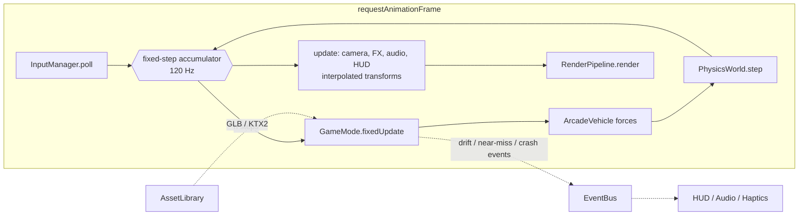

# Architecture

Cyberpunk Drift is a browser game: a high-end arcade drifter set in a rain-soaked
neon city at night. This document is the technical blueprint: what the stack is,
how the runtime is organised, and how each headline feature (the two game modes,
the atmosphere, controller support, and Blender assets) is going to be built.

> Status: **Phase 1**. Input (keyboard + gamepad + rumble), the Rapier arcade drift
> model, the follow camera and a test pad are built and tested (sections 3-4 describe
> them as implemented). Later sections are still the design. See [ROADMAP.md](ROADMAP.md)
> for build order, and [BLENDER_PIPELINE.md](BLENDER_PIPELINE.md) for the asset contract.

---

## 1. Stack

| Concern | Choice | Why |
|---|---|---|
| Platform | Browser (desktop first; controller-friendly) | Zero install, instant sharing; the Gamepad API gives full controller support including rumble |
| Rendering | **three.js r186 `WebGPURenderer` + TSL** | One node-based shader language that compiles to WGSL (WebGPU) **and** GLSL (automatic WebGL2 fallback). Ships the post stack we need as nodes: `bloom`, `ssr`, `gtao`, `traa`, `godrays`, `motionBlur`, `lut3D`. Compute shaders for rain on WebGPU |
| Physics | **Rapier** (`@dimforge/rapier3d-compat`, WASM) | Fast, deterministic, good ray/shape casts for suspension, CCD for high-speed traffic hits |
| Vehicle model | Custom arcade raycast vehicle on a Rapier rigid body | Drift feel needs authored grip curves and assists, not a tyre simulation |
| Language / build | TypeScript 7 + Vite 8 | Strict types, instant HMR, static output deployable anywhere |
| Input | Gamepad API + keyboard behind one action layer | Analogue steering and triggers, vibration, hot-plug |
| Audio | Web Audio API | Granular engine loop, positional SFX, ducking |
| UI | DOM/CSS overlay | Crisp text at any DPI, cheap, and neon CSS is easy |
| Assets | Blender Python -> glTF 2.0 `.glb` -> gltf-transform (meshopt + KTX2) | Code-generated, reproducible models; glTF also imports into Godot/Unity/Unreal if we ever move engines |

Dependencies are added in the phase that first uses them (Rapier in Phase 1, and so on), so
`package.json` only ever lists what the code imports.

---

## 2. Runtime overview



- **Composition root.** `core/Game.ts` constructs every service once and hands them to the
  active `GameMode`. There are no singletons, so tests can build a partial `Game`.
- **Fixed step, interpolated render.** Physics and gameplay run at 120 Hz. That is stable
  at 300 km/h and makes drift input feel immediate. Rendering runs at the display rate
  and interpolates body transforms between the last two physics states.
- **No ECS.** The game has a handful of entity types. Plain classes plus a typed
  `EventBus` are simpler. The one place with many entities, traffic, is data-oriented:
  struct-of-arrays state plus `InstancedMesh`/`BatchedMesh` rendering.
- **Modes are state machines.** `Boot -> Menu -> Loading -> Playing(mode) <-> Paused ->
  Results`. Each mode implements:

```ts
interface GameMode {
  enter(game: Game): Promise<void>;   // load assets, build world, spawn player
  fixedUpdate(dt: number): void;      // gameplay + physics-rate logic
  update(dt: number, alpha: number): void; // visuals, alpha = interpolation factor
  exit(): void;                       // dispose GPU resources, detach listeners
}
```

---

## 3. Controls: keyboard + full gamepad support

Every device is reduced to the same per-frame snapshot (`input/InputManager.ts`).
Gameplay never reads a device directly. Keyboard and controller work at the same time.

```ts
interface DriveInput {
  steer: number;      // -1 (left) .. 1 (right), already deadzoned and curved
  throttle: number;   // 0..1
  brake: number;      // 0..1 (also reverse once stopped)
  handbrake: boolean;
}
```

| Action | Keyboard | Gamepad (W3C "standard" mapping) |
|---|---|---|
| Steer | A / D, ← / → | Left stick X `axes[0]`: deadzone 0.1 (rescaled), outer deadzone 0.02, curve `sign(x)·|x|^1.5` |
| Throttle | W / ↑ | RT / R2 `buttons[7].value` (analogue, 4% deadzone) |
| Brake / reverse | S / ↓ | LT / L2 `buttons[6].value` (analogue) |
| Handbrake (drift) | Space | A / Cross `buttons[0]` |
| Camera: next view + reset behind car | R | Y / Triangle `buttons[3]` |
| Look around | – | Right stick `axes[2..3]` |
| Reset car (and cones) | Backspace | View / Share `buttons[8]` |
| Help overlay | H | Menu / Options `buttons[9]` |
| Rumble on / off | V | – |
| *Boost, pause (later phases)* | *Shift, Esc* | *X / Square, Start* |

- **Keyboard feels analogue.** Steering ramps in over ~0.22 s and returns faster; the
  pedals ramp over ~80 ms. Keys use `KeyboardEvent.code`, so WASD works on any layout.
- **Polling.** The Gamepad API is poll-only for state, so `GamepadDevice` reads
  `navigator.getGamepads()` once per frame and detects button edges itself. The pad that
  last produced input is the active one (hot-plug and a second pad just work). Browsers
  only expose a pad after a button press, so the HUD says "press any button".
- **Haptics** (`input/Haptics.ts`): a mix recomputed every frame from vehicle telemetry,
  sent at most every 50 ms as 110 ms effects so they overlap without gaps.

  | Event | Effect |
  |---|---|
  | Acceleration | weak motor: light buzz on throttle, surging with actual acceleration |
  | Drift / wheelspin | strong motor scaled by rear slip (plus a little weak motor) |
  | Collision | full-strength burst scaled by contact force (log scale), decaying over ~0.3 s |
  | Hard landing | strong burst scaled by vertical speed |
  | Trigger feedback | `"trigger-rumble"` when `vibrationActuator.effects` lists it (Xbox impulse triggers): right trigger on wheelspin/launch, left trigger on brake/handbrake lock |

  The API is `gamepad.vibrationActuator.playEffect("trigger-rumble" | "dual-rumble", …)`,
  falling back to Firefox's `hapticActuators[0].pulse()`. Rumble stops on window blur.
- Bindings live in `config/bindings.ts`. Remapping UI comes in Phase 5.

---

## 4. Driving model: arcade drift

`physics/vehicle/ArcadeVehicle.ts` sits on a single Rapier dynamic body, stepped at 120 Hz:

1. **Chassis.** Convex-hull collider from the GLB's `COL_body` node, with mass from the root
   `extras` and an explicit centre of mass (0.4 m) and box-approximated inertia. CCD is on,
   so it can't tunnel through walls.
2. **Wheels = physical tyre colliders + shape-cast suspension.** Each `WHEEL_*` socket gets
   a tyre-shaped cylinder collider on the chassis. Collision layers (`physics/groups.ts`)
   let tyres hit walls, pylons, kerbs and cones but not the road. The road contact belongs
   to the suspension, which sweeps the *same cylinder* down from the socket each step: the
   car rides ramp lips and kerbs on real tyre geometry, not a thin ray. If a sweep slips
   through a seam between ground colliders, a ray from the hub is the fallback.
   Fully simulated wheel bodies on joints were rejected: they are unstable at speed and
   fight authored handling.
3. **Springs.** Spring-damper per corner, sized so the static load puts each hub exactly
   at its modelled socket (1.9 Hz, ζ 0.5), with anti-roll bars moving load across each axle.
   Force acts along the contact normal.
4. **Tyres.** Rear-wheel drive with an arcade power curve (0–100 km/h in 3.9 s, ~250 km/h
   top). Lateral force follows an authored slip-angle curve (linear to a 7° peak, easing to
   a 78% slide plateau), blended to velocity-cancelling grip near standstill. A friction
   circle lets drive/brake force eat lateral grip; soft traction control applies outside drifts.
5. **Drift layer** (`DriftAssist.ts`):
   - **Traction loss.** The handbrake drops rear grip to 38% and kicks the yaw when pulled
     with steering at speed. Drift mode needs intent (a handbrake pull in the last 0.75 s,
     or a full-throttle power-over), so ordinary cornering never becomes a drift.
   - **Drift-angle assist.** Front wheels auto counter-steer toward the direction of
     travel. A yaw assist steers the slide toward a target angle: throttle holds ~30°,
     steering into the turn deepens it to 46°, a full counter-steer or lifting off lets
     it close and exit. A hard guard stops spin-outs past 62°.
   - **Speed retention.** While drifting, part of the speed that the sideways tyre forces
     scrub off is handed back along the direction of travel. Counter-steering raises
     the share (30% up to 85%), so counter-steered slides keep their speed.
   - **Stability.** Outside drift mode, slides past 3° are gently pulled back in line,
     and yaw is damped hands-off so the car tracks straight.
6. **Also:** reverse (brake at a standstill), drag and downforce, air control that levels
   the car for landings, and recovery onto its wheels after 2 s upside down.
7. **Outputs** (`VehicleTelemetry`) for the camera, rumble and HUD: speed, slip angle,
   drift state and time, grounded wheels, air time, smoothed acceleration, rear slip,
   wheelspin, brake lock, plus impact / landing events from Rapier contact-force events.

All tunables live in `config/vehicleTuning.ts`. Open the game with `?tune` for a live
`lil-gui` panel. Behaviour is pinned by headless scenario tests
(`physics/vehicle/ArcadeVehicle.test.ts`) that drive the real GLB through launch, braking,
cornering, drift entry and exit, speed retention, a ramp jump, a wall hit and kerb strikes.

### Follow camera (`camera/ChaseCamera.ts`)

Chase, far-chase and hood views (Y / R cycles and snaps behind the car).
- **Rotational lag.** The camera trails the heading and swings 30–55% toward the
  direction of travel, more while drifting.
- **Dynamic speed lag.** Follow distance grows with speed and pulls back further under
  acceleration (up to 12 m/s² × 0.1 m), then eases in.
- **FOV.** 58° + up to 16° with speed, plus a kick of up to 9° that rises fast under
  hard acceleration and relaxes slowly.
- **Also:** heavier vertical smoothing hides suspension and landing bounce, the right
  stick orbits, and impacts and hard landings shake the camera.

---

## 5. Atmosphere: rain-soaked neon night

Built on `THREE.RenderPipeline` with TSL nodes. Scene pass MRT outputs: colour, normal,
velocity, emissive.

| Layer | Technique |
|---|---|
| **Wet asphalt** | `render/materials/WetAsphalt.ts`: darkened albedo, a puddle mask (noise + road-edge falloff) driving roughness 0.5 -> 0.03, animated rain-ripple normals inside puddles, streaks of water along lane grooves |
| **Reflections** | SSR on wet surfaces (Medium+), blended by roughness; Low falls back to the environment probe plus fake emissive streaks. Neon signs and headlights stretch into long vertical smears, the signature look |
| **Neon glow** | Emissive materials whose strengths come straight from Blender (`KHR_materials_emissive_strength`), plus HDR bloom (threshold ~1.0) |
| **Volumetric fog** | Exponential height fog in the fog node (all tiers). Light shafts: `godrays` for the key light plus cheap additive "light cone" meshes under street lamps and signs (Medium+). A froxel raymarch is an Ultra-only stretch goal |
| **Rain** | GPU-instanced streaks inside a camera-anchored cylinder. Compute-updated on WebGPU, vertex-animated on WebGL2. Streak length follows camera velocity. Counts: 8k / 20k / 50k by tier. Splash sprites on the road, and lens droplets as a post effect in the chase cam |
| **Tyre smoke** | Pooled soft particles (depth fade) emitted at rear contact points in proportion to slip, tinted by a small list of nearby neon lights so the smoke glows pink/cyan |
| **Skid marks** | Ring-buffer ribbon meshes decaled onto the road, fading over time |
| **Spray** | Wheel spray on wet highway: billboards behind each tyre, scaled by speed |
| **Lights** | Only a few real lights: headlight spots (shadows on High), an underglow point light, and ≤16 clustered point lights for signs near the player. Everything else is emissive + bloom |
| **Final** | TRAA (SMAA on Low), speed-scaled motion blur, chromatic aberration and vignette while boosting, film grain, LUT grade, AgX tone mapping |

### Quality tiers (`config/quality.ts`)

| | Low | Medium | High | Ultra |
|---|---|---|---|---|
| Resolution scale | 0.75 | 0.85 | 1.0 | 1.0 |
| Reflections | env probe | SSR ½-res | SSR full | SSR full + planar road |
| AO | – | – | GTAO ½-res | GTAO |
| Rain particles | 8k | 20k | 35k | 50k |
| Light shafts | – | cones | cones + godrays | + froxel fog |
| Shadows | – | headlights 1k | 2k | 4k |
| AA | SMAA | TRAA | TRAA | TRAA |

Auto-detection picks a tier from a short GPU benchmark on first launch. The player can
change it in settings.

---

## 6. Game modes

### Free Drift: open night city

- **World.** A procedural city grid (seeded) built from the Blender city kit: road tiles,
  modular skyscrapers with emissive window atlases, neon signs, and holographic billboards
  (TSL scanline shader). Buildings render through `BatchedMesh`/`InstancedMesh`. Chunks of
  256 m stream in and out around the player.
- **Scoring.** `DriftScorer`: points = speed × drift angle × time. A combo multiplier grows
  while drifts chain within a 2 s window, and near-wall proximity adds a bonus. Marked
  **drift zones** (lit gates) hold leaderboards.
- **Loop.** Free roam, zone challenges, and collectible neon tags.

### Highway Traffic Swimming: high-speed weaving

- **Endless road.** `HighwayStreamer` generates spline segments ahead of the player and
  recycles them behind (object pool). A **floating origin** re-centres the world every 2 km,
  so float precision never degrades.
- **Traffic.** `TrafficSystem` keeps lane-based vehicles in struct-of-arrays form.
  Car-following uses the **IDM** (Intelligent Driver Model) and lane changes use **MOBIL**.
  Bodies are kinematic in Rapier; on impact they switch to dynamic. Density and speed ramp
  up over the run.
- **Scoring.** `NearMissDetector` counts a pass inside 0.8 m at more than 100 km/h as a near
  miss. Points scale with speed, and the combo builds from consecutive near misses, lane
  splits and oncoming-lane time. A crash breaks the combo; three crashes or a timer end the
  run.

---

## 7. Assets

All 3D content comes from Python scripts in `blender/scripts/`, exported to `public/models/`
as `.glb`. A naming contract (`WHEEL_FL`, `SOCKET_headlight_L`, `COL_body`, `NEON_*`/`LIGHT_*`
materials, root `extras` with physics numbers) lets the game wire up any car without
per-model code. The full contract, export settings and budgets are in
[BLENDER_PIPELINE.md](BLENDER_PIPELINE.md).

---

## 8. Performance budgets

Target: **60 fps at 1080p on High** on a GTX 1060 / Apple M1-class GPU; Low tier for
integrated graphics.

| Budget | Target |
|---|---|
| Draw calls | < 300 |
| Triangles on screen | < 1.5 M |
| Player car | ≤ 25k tris drawn (current base model: ~21k) |
| Traffic car | ≤ 5k tris LOD0, ≤ 1k LOD1 |
| Texture memory | < 512 MB (KTX2) |
| CPU per frame | gameplay + physics < 4 ms |
| Download before first drive | < 25 MB |

---

## 9. Directory layout

`✅` = exists now; everything else lands in the phase noted.

```
.
├── index.html                    ✅
├── package.json                  ✅  scripts: dev, build, typecheck, assets:car
├── tsconfig.json / vite.config.ts ✅
├── docs/
│   ├── ARCHITECTURE.md           ✅  this file
│   ├── ROADMAP.md                ✅
│   ├── BLENDER_PIPELINE.md       ✅
│   └── images/                   ✅  renders for docs
├── blender/
│   ├── scripts/
│   │   ├── cyberpunk_car.py      ✅  player car generator
│   │   ├── city_kit.py           P3  skyscraper modules, road tiles, neon signs, props
│   │   ├── traffic_cars.py       P4  sedan / van / truck / bike variants + LODs
│   │   ├── export_all.py         P3  batch-export every asset
│   │   └── lib/                  P3  shared helpers (materials, sweep/lathe, export) once a 2nd script exists
│   └── source/                   P3  hand-edited .blend files (Git LFS)
├── public/
│   ├── models/
│   │   ├── cars/player_car.glb   ✅  generated
│   │   ├── traffic/              P4
│   │   └── city/                 P3
│   ├── textures/                 P2  KTX2: asphalt, puddle masks, window & sign atlases
│   └── audio/                    P5
└── src/
    ├── main.ts                   ✅  boots Game; `?tune` adds the tuning panel
    ├── core/                     ✅  Game (composition root), FixedStepLoop (120 Hz), math
    │                             P3  EventBus, StateMachine, Pool
    ├── config/                   ✅  bindings, vehicleTuning;  P2 quality;  P3 modes
    ├── assets/                   ✅  vehicleRig (GLB naming contract -> wheels, sockets, hull, extras)
    │                             P2  AssetLibrary (meshopt + KTX2 loaders, caching)
    ├── input/                    ✅  InputManager, KeyboardDevice, GamepadDevice, curves, Haptics
    ├── physics/                  ✅  PhysicsWorld, groups, staticGeometry, vehicle/{ArcadeVehicle, TireModel, DriftAssist}
    ├── vehicles/                 ✅  PlayerCar (GLB visuals, wheels, lights);  P2 VehicleFX;  P4 TrafficCar
    ├── camera/                   ✅  ChaseCamera (chase / far / hood, speed lag, FOV kick, shake)
    ├── render/                   P2  Renderer, PostStack, QualityManager, materials/{WetAsphalt, Neon, Hologram, Windows}
    ├── fx/                       P2  Rain, Splashes, TireSmoke, SkidMarks, Spray, LensDroplets
    ├── world/                    ✅  TestTrack (grid pad, ramps, pylons, cones), materials
    │                             P3  Environment; city/{CityGenerator, ChunkStreamer, DriftZones}
    │                             P4  highway/{HighwayStreamer, FloatingOrigin}, traffic/{TrafficSystem, IDM, Mobil}
    ├── modes/                    P3  GameMode, FreeDriftMode; P4 HighwayMode
    ├── scoring/                  P3  DriftScorer, ComboMeter; P4 NearMissDetector
    ├── audio/                    P5  AudioManager, EngineSound, Sfx
    ├── ui/                       ✅  Hud (+ input / rumble monitor), TuningPanel;  P3 Menus, Settings
    └── test/                     ✅  sim.ts: headless Rapier harness driving the real GLB
```

Unit and scenario tests (Vitest, `npm test`) live next to the code as `*.test.ts`.
