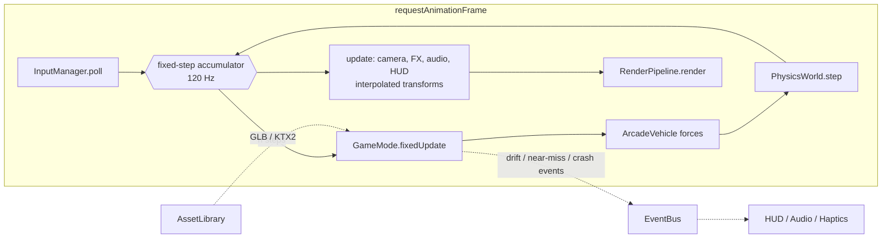

# Architecture

Cyberpunk Drift is a browser game: a high-end arcade drifter set in a rain-soaked
neon city at night. This document is the technical blueprint: what the stack is,
how the runtime is organised, and how each headline feature (the two game modes,
the atmosphere, controller support, and Blender assets) is going to be built.

> Status: **Phase 0**. The toolchain, this plan and the Blender car generator
> exist; the game systems below are the design. See [ROADMAP.md](ROADMAP.md) for
> build order, and [BLENDER_PIPELINE.md](BLENDER_PIPELINE.md) for the asset contract.

---

## 1. Stack

| Concern | Choice | Why |
|---|---|---|
| Platform | Browser (desktop first; controller-friendly) | Zero install, instant sharing; the Gamepad API gives full controller support including rumble |
| Rendering | **three.js r186 `WebGPURenderer` + TSL** | One node-based shader language that compiles to WGSL (WebGPU) **and** GLSL (automatic WebGL2 fallback). Ships the post stack we need as nodes: `bloom`, `ssr`, `gtao`, `traa`, `godrays`, `motionBlur`, `lut3D`. Compute shaders for rain on WebGPU |
| Physics | **Rapier** (`@dimforge/rapier3d-compat`, WASM) | Fast, deterministic, good ray/shape casts for suspension, CCD for high-speed traffic hits |
| Vehicle model | Custom arcade raycast vehicle on a Rapier rigid body | Drift feel needs authored grip curves and assists, not a tyre simulation |
| Language / build | TypeScript 7 + Vite 8 | Strict types, instant HMR, static output deployable anywhere |
| Input | Gamepad API + keyboard behind one action layer | Analogue steering and triggers, vibration, hot-plug |
| Audio | Web Audio API | Granular engine loop, positional SFX, ducking |
| UI | DOM/CSS overlay | Crisp text at any DPI, cheap, and neon CSS is easy |
| Assets | Blender Python -> glTF 2.0 `.glb` -> gltf-transform (meshopt + KTX2) | Code-generated, reproducible models; glTF also imports into Godot/Unity/Unreal if we ever move engines |

Dependencies are added in the phase that first uses them (Rapier in Phase 1, and so on), so
`package.json` only ever lists what the code imports.

---

## 2. Runtime overview



- **Composition root.** `core/Game.ts` constructs every service once and hands them to the
  active `GameMode`. There are no singletons, so tests can build a partial `Game`.
- **Fixed step, interpolated render.** Physics and gameplay run at 120 Hz. That is stable
  at 300 km/h and makes drift input feel immediate. Rendering runs at the display rate
  and interpolates body transforms between the last two physics states.
- **No ECS.** The game has a handful of entity types. Plain classes plus a typed
  `EventBus` are simpler. The one place with many entities, traffic, is data-oriented:
  struct-of-arrays state plus `InstancedMesh`/`BatchedMesh` rendering.
- **Modes are state machines.** `Boot -> Menu -> Loading -> Playing(mode) <-> Paused ->
  Results`. Each mode implements:

```ts
interface GameMode {
  enter(game: Game): Promise<void>;   // load assets, build world, spawn player
  fixedUpdate(dt: number): void;      // gameplay + physics-rate logic
  update(dt: number, alpha: number): void; // visuals, alpha = interpolation factor
  exit(): void;                       // dispose GPU resources, detach listeners
}
```

---

## 3. Controls: keyboard + full gamepad support

Every device is reduced to the same per-frame snapshot. Gameplay never reads a device
directly.

```ts
interface DriveInput {
  steer: number;      // -1 (left) .. 1 (right), already deadzoned and curved
  throttle: number;   // 0..1
  brake: number;      // 0..1 (also reverse when stopped)
  handbrake: boolean;
  boost: boolean;
}
```

| Action | Keyboard | Gamepad (W3C "standard" mapping) |
|---|---|---|
| Steer | A / D, Left / Right | Left stick X `axes[0]`: radial deadzone 0.12, response curve `sign(x)*abs(x)^1.6` |
| Throttle | W / Up | RT `buttons[7].value` (analogue) |
| Brake / reverse | S / Down | LT `buttons[6].value` (analogue) |
| Handbrake (drift) | Space | A / Cross `buttons[0]`, also RB `buttons[5]` |
| Boost | Shift | X / Square `buttons[2]` |
| Camera | C | Y / Triangle `buttons[3]`, right stick looks around |
| Reset car | R | Back / Select `buttons[8]` |
| Pause | Esc | Start `buttons[9]` |

- **Keyboard feels analogue.** Digital steering ramps toward its target, and the return
  speed scales with vehicle speed. Throttle and brake ramp over about 80 ms.
- **Polling.** The Gamepad API is poll-only for state, so `GamepadDevice` reads
  `navigator.getGamepads()` once per frame. `gamepadconnected`/`gamepaddisconnected` handle
  hot-plug, and the most recently used device drives the on-screen button prompts. Browsers
  only expose a pad after a button press, so the title screen says "Press any button".
- **Haptics** (`input/Haptics.ts`), all feature-detected and rate-limited, with a global
  intensity setting:

  | Event | Effect |
  |---|---|
  | Engine | weak motor, low level scaled by RPM |
  | Drift / wheelspin | strong motor scaled by rear slip |
  | Impact | short full-strength burst scaled by impulse |
  | Near miss | 40 ms weak tick |
  | Trigger feedback | `"trigger-rumble"` (impulse triggers, when `vibrationActuator.effects` lists it): throttle trigger on wheelspin, brake trigger on lock-up |

  The API is `gamepad.vibrationActuator.playEffect("dual-rumble", …)`, falling back to
  `hapticActuators[0].pulse()` where only that exists.
- Bindings live in `config/bindings.ts`. Remapping UI comes in Phase 5.

---

## 4. Driving model: arcade drift

`physics/vehicle/ArcadeVehicle.ts` sits on a single Rapier dynamic body:

1. **Chassis.** Convex hull collider from the GLB's `COL_body` node. Mass, wheelbase, track
   and wheel radius come from the GLB root's `extras` (see pipeline doc). The centre of mass
   is lowered artificially for stability.
2. **Suspension.** Four ray casts down from the `WHEEL_*` pivots, each a spring plus damper
   with anti-roll between axle pairs. The contact point, normal and surface type feed the
   tyres and FX.
3. **Tyres.** Per wheel:
   - Longitudinal force from an arcade torque curve (no gears, a "virtual shift" sound only)
     and braking.
   - Lateral force from slip angle through an authored grip curve: rises to a peak around
     8°, then falls to a plateau.
4. **Drift layer** (`DriftAssist.ts`):
   - Handbrake, or a flick at speed, drops rear grip into the plateau.
   - While drifting, the assist holds the drift angle, adds counter-steer help, and limits
     speed loss so drifts stay fast.
   - Exiting a long drift grants a short boost.
5. **Outputs** for FX, audio and scoring: per-wheel slip and contact point, drift angle,
   speed, and whether the car is airborne.

All tunables live in `config/vehicles.ts`, with a dev-only `lil-gui` panel for live tuning.

---

## 5. Atmosphere: rain-soaked neon night

Built on `THREE.RenderPipeline` with TSL nodes. Scene pass MRT outputs: colour, normal,
velocity, emissive.

| Layer | Technique |
|---|---|
| **Wet asphalt** | `render/materials/WetAsphalt.ts`: darkened albedo, a puddle mask (noise + road-edge falloff) driving roughness 0.5 -> 0.03, animated rain-ripple normals inside puddles, streaks of water along lane grooves |
| **Reflections** | SSR on wet surfaces (Medium+), blended by roughness; Low falls back to the environment probe plus fake emissive streaks. Neon signs and headlights stretch into long vertical smears, the signature look |
| **Neon glow** | Emissive materials whose strengths come straight from Blender (`KHR_materials_emissive_strength`), plus HDR bloom (threshold ~1.0) |
| **Volumetric fog** | Exponential height fog in the fog node (all tiers). Light shafts: `godrays` for the key light plus cheap additive "light cone" meshes under street lamps and signs (Medium+). A froxel raymarch is an Ultra-only stretch goal |
| **Rain** | GPU-instanced streaks inside a camera-anchored cylinder. Compute-updated on WebGPU, vertex-animated on WebGL2. Streak length follows camera velocity. Counts: 8k / 20k / 50k by tier. Splash sprites on the road, and lens droplets as a post effect in the chase cam |
| **Tyre smoke** | Pooled soft particles (depth fade) emitted at rear contact points in proportion to slip, tinted by a small list of nearby neon lights so the smoke glows pink/cyan |
| **Skid marks** | Ring-buffer ribbon meshes decaled onto the road, fading over time |
| **Spray** | Wheel spray on wet highway: billboards behind each tyre, scaled by speed |
| **Lights** | Only a few real lights: headlight spots (shadows on High), an underglow point light, and ≤16 clustered point lights for signs near the player. Everything else is emissive + bloom |
| **Final** | TRAA (SMAA on Low), speed-scaled motion blur, chromatic aberration and vignette while boosting, film grain, LUT grade, AgX tone mapping |

### Quality tiers (`config/quality.ts`)

| | Low | Medium | High | Ultra |
|---|---|---|---|---|
| Resolution scale | 0.75 | 0.85 | 1.0 | 1.0 |
| Reflections | env probe | SSR ½-res | SSR full | SSR full + planar road |
| AO | – | – | GTAO ½-res | GTAO |
| Rain particles | 8k | 20k | 35k | 50k |
| Light shafts | – | cones | cones + godrays | + froxel fog |
| Shadows | – | headlights 1k | 2k | 4k |
| AA | SMAA | TRAA | TRAA | TRAA |

Auto-detection picks a tier from a short GPU benchmark on first launch. The player can
change it in settings.

---

## 6. Game modes

### Free Drift: open night city

- **World.** A procedural city grid (seeded) built from the Blender city kit: road tiles,
  modular skyscrapers with emissive window atlases, neon signs, and holographic billboards
  (TSL scanline shader). Buildings render through `BatchedMesh`/`InstancedMesh`. Chunks of
  256 m stream in and out around the player.
- **Scoring.** `DriftScorer`: points = speed × drift angle × time. A combo multiplier grows
  while drifts chain within a 2 s window, and near-wall proximity adds a bonus. Marked
  **drift zones** (lit gates) hold leaderboards.
- **Loop.** Free roam, zone challenges, and collectible neon tags.

### Highway Traffic Swimming: high-speed weaving

- **Endless road.** `HighwayStreamer` generates spline segments ahead of the player and
  recycles them behind (object pool). A **floating origin** re-centres the world every 2 km,
  so float precision never degrades.
- **Traffic.** `TrafficSystem` keeps lane-based vehicles in struct-of-arrays form.
  Car-following uses the **IDM** (Intelligent Driver Model) and lane changes use **MOBIL**.
  Bodies are kinematic in Rapier; on impact they switch to dynamic. Density and speed ramp
  up over the run.
- **Scoring.** `NearMissDetector` counts a pass inside 0.8 m at more than 100 km/h as a near
  miss. Points scale with speed, and the combo builds from consecutive near misses, lane
  splits and oncoming-lane time. A crash breaks the combo; three crashes or a timer end the
  run.

---

## 7. Assets

All 3D content comes from Python scripts in `blender/scripts/`, exported to `public/models/`
as `.glb`. A naming contract (`WHEEL_FL`, `SOCKET_headlight_L`, `COL_body`, `NEON_*`/`LIGHT_*`
materials, root `extras` with physics numbers) lets the game wire up any car without
per-model code. The full contract, export settings and budgets are in
[BLENDER_PIPELINE.md](BLENDER_PIPELINE.md).

---

## 8. Performance budgets

Target: **60 fps at 1080p on High** on a GTX 1060 / Apple M1-class GPU; Low tier for
integrated graphics.

| Budget | Target |
|---|---|
| Draw calls | < 300 |
| Triangles on screen | < 1.5 M |
| Player car | ≤ 25k tris drawn (current base model: ~21k) |
| Traffic car | ≤ 5k tris LOD0, ≤ 1k LOD1 |
| Texture memory | < 512 MB (KTX2) |
| CPU per frame | gameplay + physics < 4 ms |
| Download before first drive | < 25 MB |

---

## 9. Directory layout

`✅` = exists now; everything else lands in the phase noted.

```
.
├── index.html                    ✅
├── package.json                  ✅  scripts: dev, build, typecheck, assets:car
├── tsconfig.json / vite.config.ts ✅
├── docs/
│   ├── ARCHITECTURE.md           ✅  this file
│   ├── ROADMAP.md                ✅
│   ├── BLENDER_PIPELINE.md       ✅
│   └── images/                   ✅  renders for docs
├── blender/
│   ├── scripts/
│   │   ├── cyberpunk_car.py      ✅  player car generator
│   │   ├── city_kit.py           P3  skyscraper modules, road tiles, neon signs, props
│   │   ├── traffic_cars.py       P4  sedan / van / truck / bike variants + LODs
│   │   ├── export_all.py         P3  batch-export every asset
│   │   └── lib/                  P3  shared helpers (materials, sweep/lathe, export) once a 2nd script exists
│   └── source/                   P3  hand-edited .blend files (Git LFS)
├── public/
│   ├── models/
│   │   ├── cars/player_car.glb   ✅  generated
│   │   ├── traffic/              P4
│   │   └── city/                 P3
│   ├── textures/                 P2  KTX2: asphalt, puddle masks, window & sign atlases
│   └── audio/                    P5
└── src/
    ├── main.ts                   ✅  Phase 0 smoke test -> boots Game in P1
    ├── core/                     P1  Game, Loop (fixed step), EventBus, StateMachine, Pool
    ├── config/                   P1  bindings, vehicles, quality, modes
    ├── assets/                   P1  AssetLibrary (GLTF + meshopt + KTX2, naming-contract parsing)
    ├── input/                    P1  InputManager, KeyboardDevice, GamepadDevice, Haptics, actions
    ├── physics/                  P1  PhysicsWorld, vehicle/{ArcadeVehicle, Suspension, TireModel, DriftAssist}
    ├── vehicles/                 P1  PlayerCar, VehicleVisual (wheels/lights/neon from GLB), VehicleFX; P4 TrafficCar
    ├── camera/                   P1  ChaseCamera, CameraShake
    ├── render/                   P2  Renderer, PostStack, QualityManager, materials/{WetAsphalt, Neon, Hologram, Windows}
    ├── fx/                       P2  Rain, Splashes, TireSmoke, SkidMarks, Spray, LensDroplets
    ├── world/                    P3  Environment; city/{CityGenerator, ChunkStreamer, DriftZones}
    │                             P4  highway/{HighwayStreamer, FloatingOrigin}, traffic/{TrafficSystem, IDM, Mobil}
    ├── modes/                    P3  GameMode, FreeDriftMode; P4 HighwayMode
    ├── scoring/                  P3  DriftScorer, ComboMeter; P4 NearMissDetector
    ├── audio/                    P5  AudioManager, EngineSound, Sfx
    └── ui/                       P3  Hud, Menus, Settings, styles.css
```

Unit tests (Vitest) arrive with the first pure-logic module in Phase 1 (tyre curves, IDM,
scoring) and live next to the code as `*.test.ts`.
